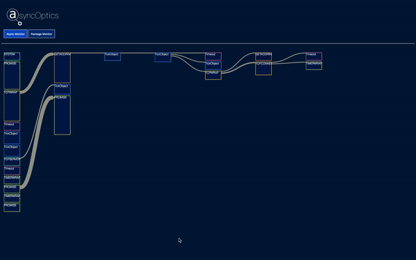

[](https://badge.fury.io/js/async-optics)

AsyncOptics is an asynchronous code viewer, performance monitor, and package monitor for Node.js and Mongodb applications. It is able to track and monitor asynchronous processes with Node.js' Async Hooks and Perf Hooks. The aggregated information is displayed in a Sankey diagram with hierarchical behavior of asynchronous functions and as a Sunburst graph for information of package monitoring. The Sankey diagram handles real-time changes for live testing and allows hovering capabilities to show specific information on desired functions on a lower panel.  

### Installation

- `npm i async-optics`

### How to use

```
const {asyncMonitor, pkgMonitor} = require('async-optics');
asyncMonitor(PortNumber);      // default 3000
pkgMonitor(complete path to package.json file);
```
- run your program, go to http://localhost:PortNumber


### Demo
* async monitor


* pkg monitor


## Contributing

This is an open source product, please feel free to fork and make pull requests!

Any suggestions are welcomed!

## Authors

[Aleksander Turberville](https://github.com/Aturberv) | [Sarah Renshaw](https://github.com/sartra) | [Penghe Wu](https://github.com/wupenghe92) | [Ralph Salazar](https://github.com/pjr4lph)

## License

This project is licensed under the MIT License - see the [LICENSE.md](LICENSE.md) file for details

## Acknowledgments
* Our Sankey diagram was built with the [Styled Sankey library](https://github.com/northam/styled_sankey/) built by [Eugene Kardash](https://github.com/northam)
